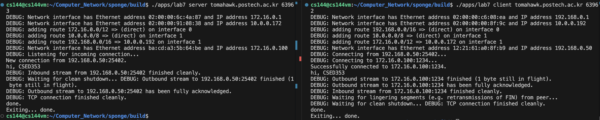
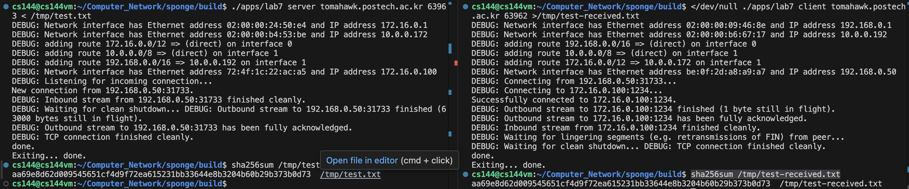
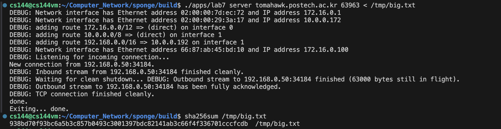
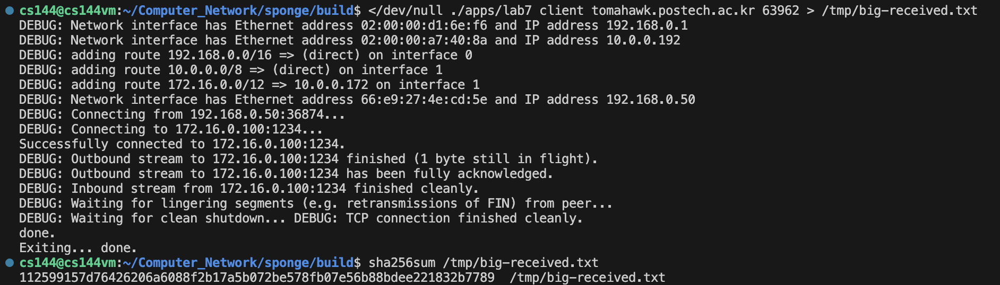

Assignment 7 Writeup
=============

My name: [Chaeyeon Jang]

My POVIS ID: [jcy2749]

My student ID (numeric): [20200952]

My assignment partner's name: [Jeongmin Oh]

My assignment partner's POVIS ID: [ojm010130]

My assignment partner's ID (numeric): [20190350]

This assignment took me about [1] hours to do (including the time on studying, designing, and writing the code).


##Solo portion:
- My implementation successfully started and ended a conversation with another copy of itself. 
    - the image below shows the conversation between client and server.
        
- My implementation successfully transfered a one-megabyte file, named test.txt, with contents identical upon receipt.
    - By executing the command below, I verified that test.txt that sender sent and test-received.txt that receiver received has same SHA-256 hashes.
        ```bash
        sha256sum /tmp/test.txt
        ```

        ```bash
        sha256sum /tmp/test-received.txt
        ```
        
    - Both test.txt and test-received.txt files have aa69e8d62d009545651cf4d9f72ea615231bb33644e8b3204b60b29b373b0d73 hash.
    - the image below shows the file transfer between client and server.
        
- No codes have been changed in the assignment 7.


##Group portion:
- Our team name is Kahn.
- My implementations successfully started and ended a conversation with the implementations of my teammates.
    - My implementations successfully acted as client.
    - My implementations successfully acted as server.
- As a server, my implementations successfully transfered a one-megabyte file, named big.txt to the client side of my teammates.
    - The hash of the big.txt is 938d70f93c6a5b3c857b0493c3001397bdc82141ab3c66f4f336701cccfcdb, and it matches the hash of the big-received.txt of my teammate.
    - The image below shows the file transfer as a server side. 
        
- As a client, my implementations successfully received a one-megabyte file, named big-received.txt from the server side of my teammates.
    - The has of the big-received,txt is 112599157d76426206a6088f2b17a5b072be578fb07e56b88bdee221832b7789, and it matched the hash of the big.txt of my teammate.
    - The image below shows the file transfer as a client side.
        
- No codes of my implementations have been changed in the assignment 7.
- No codes of my teammate's implementations have been changed in the assignment 7.
